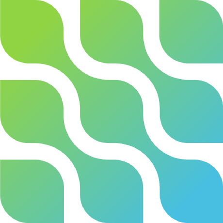

# Adam Furqon

`Web and Android Developer`

I am a web and android developer. All coding projects are built from the ground up, from planning and designing to solving real problems with code. 
___
### Adam Furqon Journey

I started coding when I was in high school, where my major was software engineering and I majored in computer science in college.
Sometimes I am a full-stack developer, but my main passion is in the backend web and android developer section. My work experience started in 2019 where I was a freelancer to work on projects and in 2023 until now I have worked as a programmer at Pakuan University.

The programming language that is often used is php. The journey of using this programming language is quite long in my self-development until now, from native to frameworks that I have mastered such as codeigniter and laravel. Android development uses the Java programming language, but because of the demands of my work I don't have time to hone it again so I am very far behind with existing developments. but with that lag I started again with a new technology, namely flutter.

I am used to developing applications from scratch, both from brainstorming, system design planning and development itself. Besides that, I always learn new things to solve new problems and update existing code. The knowledge that has been obtained I always experiment with cases that have been experienced, such as: refactoring, system design, microservice, race condition, sso, synchronization of different server databases and many others. sometimes I have failed to understand something but my nature that never gives up and is always thirsty to know, I am even willing to spend money just to buy training / private courses with people who have that knowledge. Even though I already work, I am still open to looking for job vacancies both onsite and remote.

___

### Language & Tools

